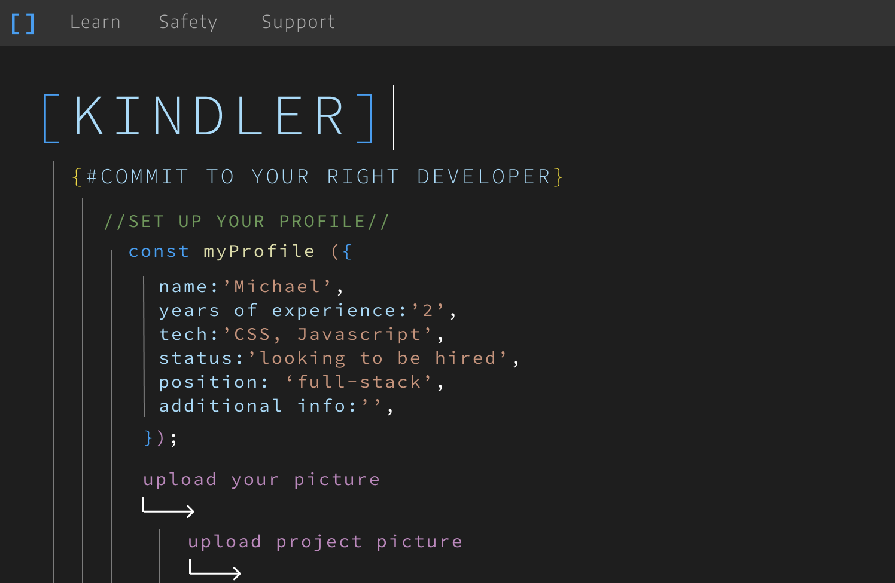

# Kindler - Commit to your right developer


### Project Description


Kindler is a streamlined way for software developers and recruiters to match with each other. The app presents a recruiter with an easy to navigate interface where they can see prospective developers and a quick snapshot of their skills and projects. If a recruiter decides a developer is a good match, they can contact the potential hire and quickly find a role for them.


### Project Image: 




### Deployed URL:


```
The site is hosted on Heroku, so please allow a few moments for the app to spin up.
```

[Kindler Live Deployment](https://guarded-castle-49878.herokuapp.com/)

<br>

### Technologies Used:
- MongoDB
- Express
- React
- Node.js
- Redux
- Heroku
- MongoDB Atlas
- graphql
- jwt-decode

### Team:
- Daniel Hong
  [Daniel's GitHub](https://github.com/Lunirs)
- Andrew McKelvey
  [Andrew's GitHub](https://github.com/amckelvey)
- Brian Sa Uk Chung
  [Brian's GitHub](https://github.com/saukchung)
- Yafei Liu
  [Yafei's GitHub](https://github.com/lyf703331869)
- Shay O'Sullivan
  [Shay's GitHub](https://github.com/shayosullivan)
- Tasha Akemah
  [Tasha's GitHub](https://github.com/taa2153)


