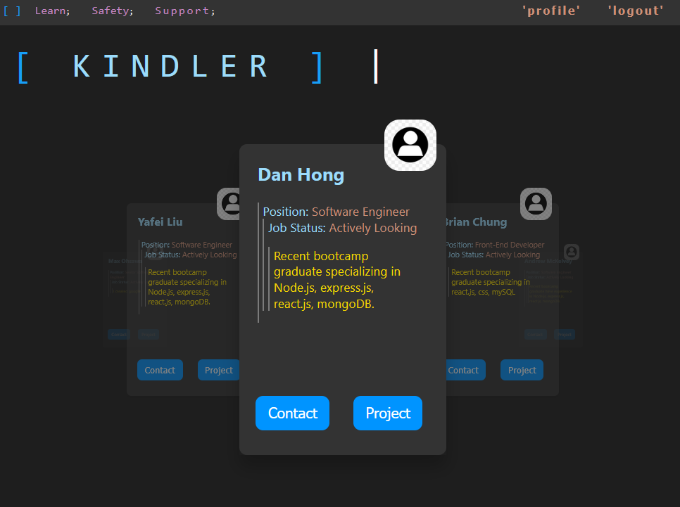
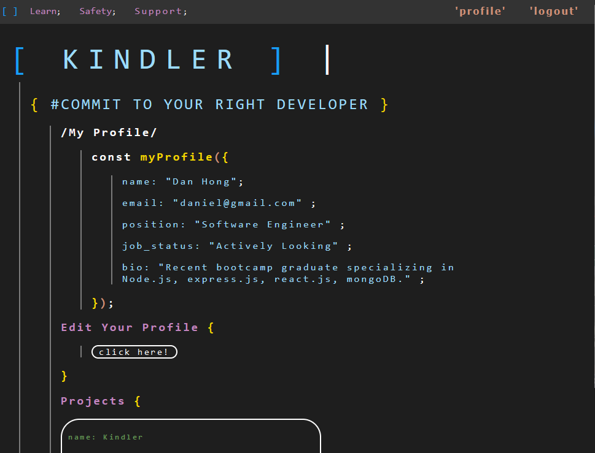

# Kindler - Commit to your right developer

## Description

Kindler is a streamlined way for software developers and recruiters to match with each other. The app presents a recruiter with an easy to navigate interface where they can see prospective developers and a quick snapshot of their skills and projects. If a recruiter decides a developer is a good match, they can contact the potential hire and quickly find a role for them.

### Deployed URL:

> The site is hosted on Heroku, so please allow a few moments for the app to spin up.

[Kindler Live Deployment](https://guarded-castle-49878.herokuapp.com/)

 

## Tech Used

1. Node.js
2. React.js
3. Express.js
4. MongoDB / Mongoose
5. GraphQL
6. react-spring-3d-carousel
7. dotenv
8. CSS
9. JavaScript

## ScreenShots

## Technologies Used:

- MongoDB
- Express
- React
- Node.js
- Redux
- Heroku
- MongoDB Atlas
- graphql
- jwt-decode

## Team:

- Daniel Hong
  [Daniel's GitHub](https://github.com/Lunirs)
- Andrew McKelvey
  [Andrew's GitHub](https://github.com/amckelvey)
- Brian Sa Uk Chung
  [Brian's GitHub](https://github.com/saukchung)
- Yafei Liu
  [Yafei's GitHub](https://github.com/lyf703331869)
- Shay O'Sullivan
  [Shay's GitHub](https://github.com/shayosullivan)
- Tasha Akemah
  [Tasha's GitHub](https://github.com/taa2153)

## License

Licensed under the MIT license.

## Credits

Copyright © Daniel Hong | Andrew McKelvey, Brian Chung, Shay O'Sullivan, Tasha Akemah, Yafei Liu All rights reserved.
